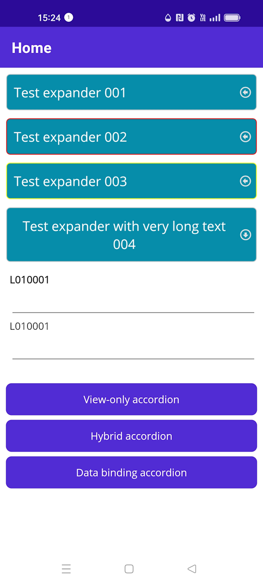
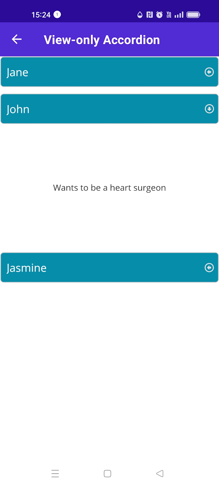
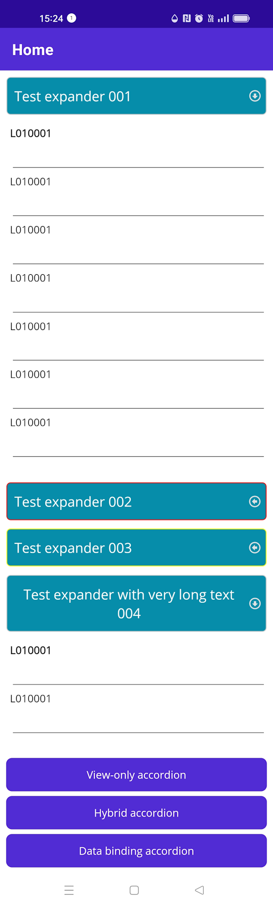

# mpo.Expander.Maui

I extended the original expander with a predefined header that has a section for text (width *) and icon text (width 30). I modified the expander to make it easier to use.

## Summary

<div style="display: flex;">
    
    
    
</div>

I added properties that can set the expander header styles.

| Type       | Property                  | Description                                                             | Default Value |
|------------|---------------------------|-------------------------------------------------------------------------|---------------|
| String     | HeaderTextProperty        | Your text in the header                                                 | string.Empty  |
| Style      | HeaderBorderStyleProperty | Defining the Header Border Style                                        | Style         |    
| Style      | HeaderTextStyleProperty   | Defining the header text style.                                         | Style         |    
| Style      | HeaderIconStyleProperty   | Definování stylu ikony hlavičky.                                        | Style         | 
| Double     | HeaderIconDefaultRotationAngleProperty | Default icon rotation                                      | 0D            |
| Double     | HeaderIconRotateAngleProperty | Rotate icon by                                                      | -90D          |

I used the font for the icon materialdesignicons.ttf
To view the font code, you can use the page: https://andreinitescu.github.io/IconFont2Code/

## Usage

### Registration

Registration of the control strictly isn't required, because it only uses standard controls natively supported by .NET MAUI at the moment. However, a registration method is provided in case that some future version requires to do so:

```c#
using epj.Expander.Maui;
using Microsoft.Extensions.Logging;

namespace ExpanderSample
{
    public static class MauiProgram
    {
        public static MauiApp CreateMauiApp()
        {
            var builder = MauiApp.CreateBuilder();
            builder
                .UseMauiApp<App>()
                .UseExpander()
                .ConfigureFonts(fonts =>
                {
                    fonts.AddFont("OpenSans-Regular.ttf", "OpenSansRegular");
                    fonts.AddFont("OpenSans-Semibold.ttf", "OpenSansSemibold");
                    fonts.AddFont("materialdesignicons.ttf", "MaterialDesignIconsFont");
                });

#if DEBUG
		builder.Logging.AddDebug();
#endif

            // enable animations for Android & iOS
            Expander.EnableAnimations();

            return builder.Build();
        }
    }
}

```

### XAML

Add App.xaml:  <ResourceDictionary Source="Resources/Styles/ExpanderStyles.xaml" />
```xml
<?xml version = "1.0" encoding = "UTF-8" ?>
<Application xmlns="http://schemas.microsoft.com/dotnet/2021/maui"
             xmlns:x="http://schemas.microsoft.com/winfx/2009/xaml"
             xmlns:local="clr-namespace:ExpanderSample"
             x:Class="ExpanderSample.App">
    <Application.Resources>
        <ResourceDictionary>
            <ResourceDictionary.MergedDictionaries>
                <ResourceDictionary Source="Resources/Styles/Colors.xaml" />
                <ResourceDictionary Source="Resources/Styles/Styles.xaml" />
                <ResourceDictionary Source="Resources/Styles/ExpanderStyles.xaml" />
            </ResourceDictionary.MergedDictionaries>
        </ResourceDictionary>
    </Application.Resources>
</Application>

```

Add namespace: xmlns:ExpanderControl="clr-namespace:epj.Expander.Maui;assembly=mpo.Expander.Maui"
```xml

      <!--Default style defined in ExpanderStyles.xaml -->
      <ExpanderControl:Expander Animated="True" HeaderText="Test expander 001">
        <StackLayout Style="{StaticResource ExpanderContentStackLayout}">
          <Label Text="L010001" FontAttributes="Bold"></Label>
          <Editor></Editor>
          <Label Text="L010001"></Label>
          <Editor></Editor>
          <Label Text="L010001"></Label>
          <Editor></Editor>
          <Label Text="L010001"></Label>
          <Editor></Editor>
          <Label Text="L010001"></Label>
          <Editor></Editor>
          <Label Text="L010001"></Label>
          <Editor></Editor>
          <Label Text="L010001"></Label>
          <Editor></Editor>
        </StackLayout>
      </ExpanderControl:Expander>

      
      <ExpanderControl:Expander Animated="True" ExpandDuration="1000"  
                     HeaderText="Test expander 002"
                     HeaderBorderStyle="{StaticResource ExpanderHeaderBorder2}"
                     HeaderTextStyle="{StaticResource ExpanderHeaderText}"
                     HeaderIconStyle="{StaticResource ExpanderHeaderIcon}"
                     >
        <VerticalStackLayout Style="{StaticResource ExpanderContentVerticalStackLayout}">
          <Label Text="L010001" FontAttributes="Bold" Style="{StaticResource ExpanderHeaderText}"></Label>
          <Editor></Editor>
          <Label Text="L010001"></Label>
          <Editor></Editor>
          <Label Text="L010001"></Label>
          <Editor></Editor>
          <Label Text="L010001"></Label>
          <Editor></Editor>
          <Label Text="L010001"></Label>
          <Editor></Editor>
          <Label Text="L010001"></Label>
          <Editor></Editor>
          <Label Text="L010001"></Label>
          <Editor></Editor>
        </VerticalStackLayout>
      </ExpanderControl:Expander>

      <!--The modified style defined in ExpanderStyles.xaml with the style name ExpanderTemplate.-->
      <ExpanderControl:Expander Animated="True" HeaderText="Test expander 003" Style="{StaticResource ExpanderTemplate}">
        <StackLayout Style="{StaticResource ExpanderContentStackLayout}">
          <Label Text="L010001" FontAttributes="Bold"></Label>
          <Editor></Editor>
          <Label Text="L010001"></Label>
          <Editor></Editor>
          <Label Text="L010001"></Label>
          <Editor></Editor>
          <Label Text="L010001"></Label>
          <Editor></Editor>
          <Label Text="L010001"></Label>
          <Editor></Editor>
          <Label Text="L010001"></Label>
          <Editor></Editor>
          <Label Text="L010001"></Label>
          <Editor></Editor>
        </StackLayout>
      </ExpanderControl:Expander>

      <ExpanderControl:Expander Animated="True" HeaderText="Test expander with very long text 004">
        <StackLayout Style="{StaticResource ExpanderContentStackLayout}">
          <Label Text="L010001" FontAttributes="Bold"></Label>
          <Editor></Editor>
          <Label Text="L010001"></Label>
          <Editor></Editor>
        </StackLayout>
      </ExpanderControl:Expander>
```

## Styles

..sample\ExpanderSample\Resources\Styles\ExpanderStyles.xaml

```xml
<?xml version="1.0" encoding="utf-8" ?>
<ResourceDictionary xmlns="http://schemas.microsoft.com/dotnet/2021/maui"
             xmlns:x="http://schemas.microsoft.com/winfx/2009/xaml"
                   xmlns:ExpanderControl="clr-namespace:epj.Expander.Maui;assembly=mpo.Expander.Maui">
  
  <x:Double x:Key="BasicFontSize">18</x:Double>
  <SolidColorBrush x:Key="ColorExpander" Color="#068DA9"></SolidColorBrush>


  <Style TargetType="Border" x:Key="ExpanderHeaderBorder3">
    <Setter Property="Background" Value="{StaticResource ColorExpander}"></Setter>
    <Setter Property="StrokeThickness" Value="1" />
    <Setter Property="VerticalOptions" Value="Center"></Setter>
    <Setter Property="Stroke" Value="Yellow"></Setter>
    <Setter Property="StrokeShape">
      <Setter.Value>
        <RoundRectangle CornerRadius="5" />
      </Setter.Value>
    </Setter>
    <Setter Property="Margin" Value="0,0,0,4"></Setter>
    <Setter Property="Padding" Value="0,12,0,12"></Setter>
    <Setter Property="HorizontalOptions" Value="Fill"></Setter>
    <Setter Property="VerticalOptions" Value="Center"></Setter>
    <Setter Property="MinimumHeightRequest" Value="40"></Setter>
  </Style>

  <Style TargetType="Border" x:Key="ExpanderHeaderBorder2">
    <Setter Property="Background" Value="{StaticResource ColorExpander}"></Setter>
    <Setter Property="StrokeThickness" Value="1" />
    <Setter Property="VerticalOptions" Value="Center"></Setter>
    <Setter Property="Stroke" Value="Red"></Setter>
    <Setter Property="StrokeShape">
      <Setter.Value>
        <RoundRectangle CornerRadius="5" />
      </Setter.Value>
    </Setter>
    <Setter Property="Margin" Value="0,0,0,4"></Setter>
    <Setter Property="Padding" Value="0,12,0,12"></Setter>
    <Setter Property="HorizontalOptions" Value="Fill"></Setter>
    <Setter Property="VerticalOptions" Value="Center"></Setter>
    <Setter Property="MinimumHeightRequest" Value="40"></Setter>
  </Style>


  <Style TargetType="Border" x:Key="ExpanderHeaderBorder">
    <Setter Property="Background" Value="{StaticResource ColorExpander}"></Setter>
    <Setter Property="StrokeThickness" Value="1" />
    <Setter Property="VerticalOptions" Value="Center"></Setter>
    <Setter Property="StrokeShape">
      <Setter.Value>
        <RoundRectangle CornerRadius="5" />
      </Setter.Value>
    </Setter>
    <Setter Property="Margin" Value="0,0,0,4"></Setter>
    <Setter Property="Padding" Value="0,12,0,12"></Setter>
    <Setter Property="HorizontalOptions" Value="Fill"></Setter>
    <Setter Property="VerticalOptions" Value="Center"></Setter>
    <Setter Property="MinimumHeightRequest" Value="40"></Setter>
  </Style>

  <Style TargetType="Label" x:Key="ExpanderHeaderText">
    <Setter Property="TextColor" Value="{AppThemeBinding Light={StaticResource White}, Dark={StaticResource Primary}}"/>
    <Setter Property="FontFamily" Value="OpenSansRegular" />
    <Setter Property="FontSize" Value="{StaticResource BasicFontSize}" />
    <Setter Property="Background" Value="Transparent"></Setter>
    <Setter Property="HorizontalTextAlignment" Value="Center"></Setter>
    <Setter Property="VerticalTextAlignment" Value="Center"></Setter>
    <Setter Property="HorizontalOptions" Value="StartAndExpand"></Setter>
    <Setter Property="Margin" Value="10,0,0,0"></Setter>

    <Setter Property="VisualStateManager.VisualStateGroups">
      <VisualStateGroupList>
        <VisualStateGroup x:Name="CommonStates">
          <VisualState x:Name="Normal" />
          <VisualState x:Name="Disabled">
            <VisualState.Setters>
              <Setter Property="TextColor" Value="{AppThemeBinding Light={StaticResource Gray300}, Dark={StaticResource Gray600}}" />
            </VisualState.Setters>
          </VisualState>
        </VisualStateGroup>
      </VisualStateGroupList>
    </Setter>
  </Style>

  <Style TargetType="Label" x:Key="ExpanderHeaderIcon">
    <Setter Property="FontFamily" Value="MaterialDesignIconsFont" />
    <Setter Property="TextColor" Value="{StaticResource Gray100}"></Setter>
    <Setter Property="Text" Value="&#xf050;"></Setter>
    <Setter Property="Background" Value="Transparent"></Setter>
    <Setter Property="FontSize" Value="Medium" />
    <Setter Property="Margin" Value="0"></Setter>
    <Setter Property="Padding" Value="0"></Setter>
    <Setter Property="HorizontalOptions" Value="Center"></Setter>
    <Setter Property="VerticalOptions" Value="Center"></Setter>

  </Style>


  <Style TargetType="StackLayout" x:Key="ExpanderContentStackLayout">
    <Setter Property="Margin" Value="0,0,0,4"></Setter>
    <Setter Property="Padding" Value="5, 10, 0 ,15"></Setter>
  </Style>
  <Style TargetType="HorizontalStackLayout" x:Key="ExpanderContentHorizontalStackLayout">
    <Setter Property="Margin" Value="0,0,0,4"></Setter>
    <Setter Property="Padding" Value="5, 10, 0 ,15"></Setter>
  </Style>

  <Style TargetType="VerticalStackLayout" x:Key="ExpanderContentVerticalStackLayout">
    <Setter Property="Margin" Value="0,0,0,4"></Setter>
    <Setter Property="Padding" Value="5, 10, 0 ,15"></Setter>
  </Style>

  <!--<Setter Property="Text" Value="&#xf048;"></Setter>-->


  <Style TargetType="ExpanderControl:Expander" ApplyToDerivedTypes="True">
    <Setter Property="HeaderBorderStyle" Value="{DynamicResource ExpanderHeaderBorder}"></Setter>
    <Setter Property="HeaderTextStyle" Value="{DynamicResource ExpanderHeaderText}"></Setter>
    <Setter Property="HeaderIconStyle" Value="{DynamicResource ExpanderHeaderIcon}"></Setter>
  </Style>


  <Style TargetType="ExpanderControl:Expander" x:Key="ExpanderTemplate" ApplyToDerivedTypes="True">
    <Setter Property="HeaderBorderStyle" Value="{DynamicResource ExpanderHeaderBorder3}"></Setter>
    <Setter Property="HeaderTextStyle" Value="{DynamicResource ExpanderHeaderText}"></Setter>
    <Setter Property="HeaderIconStyle" Value="{DynamicResource ExpanderHeaderIcon}"></Setter>
  </Style>

</ResourceDictionary>
```


============================================
============================================
============================================
# epj.Expander.Maui


[](https://www.nuget.org/packages/epj.Expander.Maui/)

A simple Expander control for .NET MAUI

## Summary

This is a simple Expander control for .NET MAUI which can be used standalone as well as like accordion. The header and body are fully customizable and the expanding and collapsing of the body can be animated.

***Note**: Animations are experimental at the moment and require an explicit opt-in.*

<div style="display: flex;">
    
    
</div>

## Platforms

| Platform    | Supported  |
|-------------|------------|
| Android     | Yes        |
| iOS         | Yes        |
| Windows     | Yes        |
| MacCatalyst | *Untested* |

## Usage

### Registration *(not required at this moment)*

Registration of the control strictly isn't required, because it only uses standard controls natively supported by .NET MAUI at the moment. However, a registration method is provided in case that some future version requires to do so:

```c#
public static MauiApp CreateMauiApp()
{
    var builder = MauiApp.CreateBuilder();
    builder
        .UseMauiApp<App>()
        .UseExpander() // optional: add this
        .ConfigureFonts(fonts =>
        {
            fonts.AddFont("OpenSans-Regular.ttf", "OpenSansRegular");
            fonts.AddFont("OpenSans-Semibold.ttf", "OpenSansSemibold");
        });

    return builder.Build();
}
```

### XAML

```xml
<maui:Expander
  Command="{Binding Source={RelativeSource AncestorType={x:Type expanderSample:MainViewModel}}, Path=PrintCommand}"
  CommandParameter="{Binding Name}"
  HeaderTapped="Expander_OnHeaderTapped">

  <!-- add header content -->
  <maui:Expander.HeaderContent>
    <Grid
      HeightRequest="80"
      BackgroundColor="Orange">
      <Label
        Text="{Binding Name}"
        VerticalOptions="Center"
        HorizontalOptions="Center" />
    </Grid>
  </maui:Expander.HeaderContent>

  <!-- add body content -->
  <Grid
    HeightRequest="200"
    BackgroundColor="SkyBlue">
    <Label
      Text="{Binding Name}"
      VerticalOptions="Center"
      HorizontalOptions="Center" />
  </Grid>
</maui:Expander>
```

## Properties

Most of these properties are bindable for MVVM goodness. Please let me know if something is missing or not working as expected.

| Type       | Property             | Description                                                             | Default Value |
|------------|----------------------|-------------------------------------------------------------------------|---------------|
| View       | HeaderContent        | Use to set the header content, can be any type of View or Layout        | null          |
| View       | BodyContent          | Use to set the body content, can be any type of View or Layout          | null          |
| ICommand   | Command              | The command to be invoked when the header is tapped                     | null          |
| object     | CommandParameter     | The optional command parameter                                          | null          |
| bool       | IsExpanded           | Use to get or set whether the Expander is expanded.                     | false         |
| bool       | Animated             | Use to enable animations - requires opt-in, see below under [Animation](https://github.com/ewerspej/epj.Expander.Maui#animations) | false         |
| Easing     | ExpandEasing         | Use to set the type of [Easing](https://learn.microsoft.com/dotnet/api/microsoft.maui.easing) for the expand animation             | CubicIn       |
| Easing     | CollapseEasing       | Use to set the type of [Easing](https://learn.microsoft.com/dotnet/api/microsoft.maui.easing) for the collapse animation           | CubicOut      |
| uint       | ExpandDuration       | Use to set the duration of the expand animation in milliseconds         | 250           |
| uint       | CollapseDuration     | Use to set the duration of the collapse animation in milliseconds       | 250           |

## Events

The control exposes two events:

* `HeaderTapped`: Fires when the header is tapped by the user
* `IsExpandedChanged`: Fires whenever the `IsExpanded` property has changed

## Animations

Animations are currently experimental, the implementation is not well tested and may be subject to change in the future. Generally, animations come with a performance penalty and when used extensively, they may slow down the application.

Therefore, animations at this time require an explicit opt-in. Anywhere in your code, but ideally in *MauiProgram.cs*, add the following line of code:


```c#
Expander.EnableAnimations();
```

After that, setting the `Animate` property to `True` will take effect:

```xml
<maui:Expander
  Animate="True"
  CollapseDuration="100"
  ExpandDuration="200"
  CollapseEasing="{x:Static Easing.SpringOut}"
  ExpandEasing="{x:Static Easing.SpringIn}">
  <maui:Expander.HeaderContent>
    <!-- header -->
  </maui:Expander.HeaderContent>
  <!-- body -->
</maui:Expander>
```

# Examples

If you are looking for a more extensive example for the potential usage of the control, e.g. if you are looking for a demo of the accordion-style functionality, have a look at the code in this repository. The sample app provides some examples and starting points.

# Support

You can support this project by starring it on GitHub, sharing it with others or contributing to it. If you have any questions, feedback or ideas, feel free to open an issue or reach out to me.

Additionally, you can support me by buying me a coffee or by becoming a sponsor.

<a href="https://www.buymeacoffee.com/ewerspej" target="_blank"></a>
